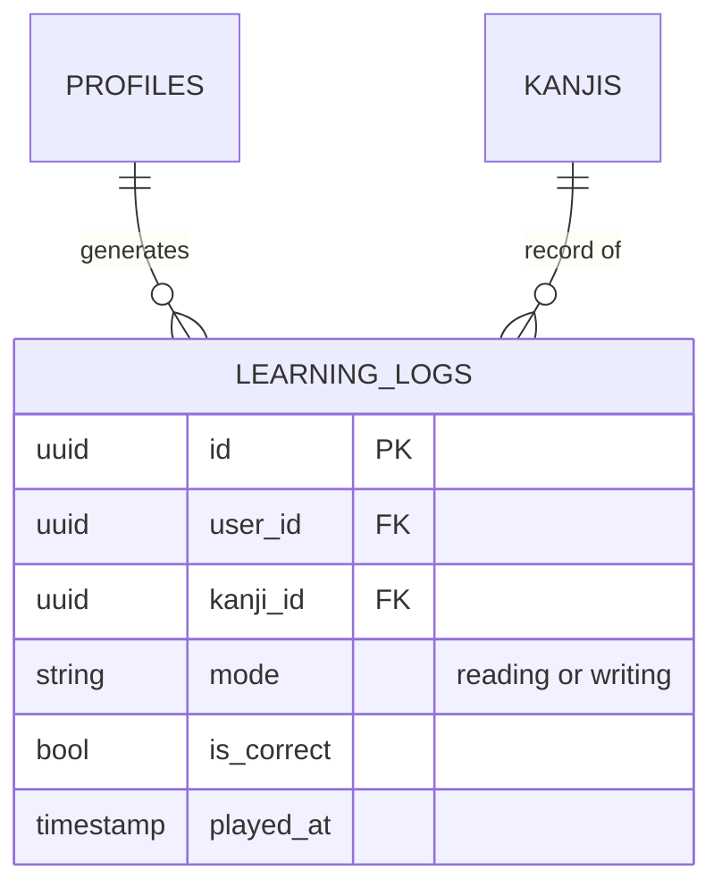

# データベース設計書 (Database Design Document)

## 1. 概要
（変更なし）

## 2. ER図 (Entity Relationship Diagram)
（基本構造は維持。`LEARNING_LOGS` と `MISSIONS` に変更あり）

## 3. テーブル詳細定義

### 3.1. ユーザー管理 (User Management)
（変更なし）

### 3.2. マスタデータ (Master Data)
（変更なし）

### 3.3. ユーザーデータ (User Data)

#### `learning_logs`
学習（ゲームプレイ）の履歴。分析や苦手判定に使用。

| カラム名 | データ型 | 制約 | 説明 |
| :--- | :--- | :--- | :--- |
| `id` | uuid | PK | ログID。 |
| `user_id` | uuid | FK | ユーザーID。 |
| `kanji_id` | uuid | FK | 出題された漢字ID。 |
| `mode` | text | NOT NULL | **追加:** 学習モード ('reading', 'writing')。 |
| `is_correct` | boolean | NOT NULL | 正解したかどうか（書き取りの場合は完了したかどうか）。 |
| `selected_reading` | text | | ユーザーの回答（読みモード時）。 |
| `stroke_accuracy` | integer | | **追加:** 書き取り時の正確性スコア（オプション）。 |
| `response_time_ms` | integer | | 回答にかかった時間（ミリ秒）。 |
| `played_at` | timestamptz | DEFAULT now() | プレイ日時。 |

（その他のテーブルは変更なし）

### 3.4. 保護者機能 (Parent Features)
（変更なし）

## 4. セキュリティ設計 (RLS Policies)
（変更なし）

## 5. ストアドプロシージャ
（変更なし）
