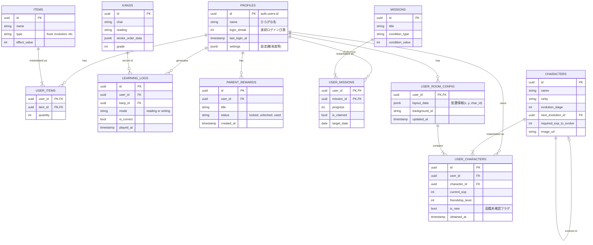

# データベース設計書 (Database Design Document)

## 1. 概要
本プロジェクトではバックエンドサービスとして **Supabase (PostgreSQL)** を採用します。
本ドキュメントでは、Epicおよびユースケースに基づいたデータモデル、テーブル定義、およびセキュリティポリシー（RLS）について記述します。

## 2. ER図 (Entity Relationship Diagram)



## 3. テーブル詳細定義

### 3.1. ユーザー管理 (User Management)

#### `profiles`
Supabase Authの `auth.users` テーブルと 1:1 で紐づくユーザープロフィール情報。

| カラム名 | データ型 | 制約 | 説明 |
| :--- | :--- | :--- | :--- |
| `id` | uuid | PK, FK | `auth.users.id` への外部キー。ユーザー識別子。 |
| `name` | text | NOT NULL | ユーザー名（ひらがな推奨）。 |
| `login_streak` | integer | DEFAULT 0 | 連続ログイン日数。デイリーボーナス判定用。 |
| `last_login_at` | timestamptz | | 最終ログイン日時。連続ログイン判定用。 |
| `settings` | jsonb | DEFAULT '{}' | アプリ設定（難易度設定、BGM音量など）。 |
| `created_at` | timestamptz | DEFAULT now() | 作成日時。 |
| `updated_at` | timestamptz | DEFAULT now() | 更新日時。 |

---

### 3.2. マスタデータ (Master Data)

#### `characters`
ゲームに登場するキャラクターの定義。

| カラム名 | データ型 | 制約 | 説明 |
| :--- | :--- | :--- | :--- |
| `id` | uuid | PK | キャラクターID。 |
| `name` | text | NOT NULL | キャラクター名。 |
| `description` | text | | キャラクターの説明文。 |
| `rarity` | text | NOT NULL | レアリティ ('N', 'R', 'SR', 'SSR')。 |
| `element` | text | | 属性（必要であれば）。 |
| `evolution_stage` | integer | DEFAULT 1 | 進化段階 (1, 2, 3...)。 |
| `next_evolution_id` | uuid | FK | 進化先の `characters.id`。進化しない場合はNULL。 |
| `required_exp_to_evolve` | integer | | 進化に必要な経験値。 |
| `image_url` | text | NOT NULL | キャラクター画像のパス。 |
| `silhouette_url` | text | | 未取得時に表示するシルエット画像のパス。 |

#### `items`
エサや進化素材などのアイテム定義。

| カラム名 | データ型 | 制約 | 説明 |
| :--- | :--- | :--- | :--- |
| `id` | uuid | PK | アイテムID。 |
| `name` | text | NOT NULL | アイテム名。 |
| `description` | text | | アイテム説明。 |
| `type` | text | NOT NULL | アイテム種別 ('food', 'ticket', etc)。 |
| `effect_value` | integer | DEFAULT 0 | 効果量（エサの場合は経験値上昇量）。 |
| `image_url` | text | | アイテム画像のパス。 |

#### `kanjis`
学習対象の漢字データ。

| カラム名 | データ型 | 制約 | 説明 |
| :--- | :--- | :--- | :--- |
| `id` | uuid | PK | 漢字ID。 |
| `char` | varchar(1) | NOT NULL | 漢字本体（例: '山'）。 |
| `reading` | text | NOT NULL | 正しい読み（ひらがな）。 |
| `onyomi` | text[] | | 音読みリスト（オプション）。 |
| `kunyomi` | text[] | | 訓読みリスト（オプション）。 |
| `grade` | integer | | 学習学年。 |
| `stroke_count` | integer | | 画数。 |
| `stroke_order_data` | jsonb | | 書き順アニメーション用データ（SVGパス等）。 |
| `wrong_readings` | text[] | | 誤答の選択肢候補。 |

#### `missions`
デイリーミッションや実績の定義。

| カラム名 | データ型 | 制約 | 説明 |
| :--- | :--- | :--- | :--- |
| `id` | uuid | PK | ミッションID。 |
| `title` | text | NOT NULL | ミッションタイトル（例:「かんじを3もんクリアしよう」）。 |
| `description` | text | | 詳細説明。 |
| `category` | text | NOT NULL | カテゴリ ('daily', 'achievement', 'special')。 |
| `condition_type` | text | NOT NULL | 達成条件種別 ('play_count', 'clear_count', 'login', etc)。 |
| `condition_value` | integer | NOT NULL | 達成に必要な回数や数値。 |
| `reward_item_id` | uuid | FK | 報酬アイテムID（`items.id`）。 |
| `reward_quantity` | integer | DEFAULT 1 | 報酬個数。 |

---

### 3.3. ユーザーデータ (User Data)

#### `user_characters`
ユーザーが所持しているキャラクター（図鑑・育成状況）。

| カラム名 | データ型 | 制約 | 説明 |
| :--- | :--- | :--- | :--- |
| `id` | uuid | PK | ユニークID。 |
| `user_id` | uuid | FK | ユーザーID。 |
| `character_id` | uuid | FK | マスタデータのキャラクターID。 |
| `current_exp` | integer | DEFAULT 0 | 現在の経験値。 |
| `friendship_level` | integer | DEFAULT 0 | なつき度（ハート数）。 |
| `is_new` | boolean | DEFAULT true | 図鑑未確認フラグ（NEWマーク用）。 |
| `is_favorite` | boolean | DEFAULT false | ホーム画面表示用のお気に入りフラグ。 |
| `obtained_at` | timestamptz | DEFAULT now() | 獲得日時。 |

#### `user_items`
ユーザーの所持アイテム（インベントリ）。

| カラム名 | データ型 | 制約 | 説明 |
| :--- | :--- | :--- | :--- |
| `user_id` | uuid | PK, FK | ユーザーID。 |
| `item_id` | uuid | PK, FK | アイテムID。 |
| `quantity` | integer | DEFAULT 0 | 所持数。 |
| `updated_at` | timestamptz | DEFAULT now() | 最終更新日時。 |

#### `learning_logs`
学習（ゲームプレイ）の履歴。分析や苦手判定に使用。

| カラム名 | データ型 | 制約 | 説明 |
| :--- | :--- | :--- | :--- |
| `id` | uuid | PK | ログID。 |
| `user_id` | uuid | FK | ユーザーID。 |
| `kanji_id` | uuid | FK | 出題された漢字ID。 |
| `mode` | text | NOT NULL | **追加:** 学習モード ('reading', 'writing')。 |
| `is_correct` | boolean | NOT NULL | 正解したかどうか（書き取りの場合は完了したかどうか）。 |
| `selected_reading` | text | | ユーザーの回答（読みモード時）。 |
| `stroke_accuracy` | integer | | **追加:** 書き取り時の正確性スコア（オプション）。 |
| `response_time_ms` | integer | | 回答にかかった時間（ミリ秒）。 |
| `played_at` | timestamptz | DEFAULT now() | プレイ日時。 |

#### `user_missions`
ユーザーごとのミッション進捗状況。
※デイリーミッションの場合、日付ごとにレコードを作成するか、`target_date`で管理する。

| カラム名 | データ型 | 制約 | 説明 |
| :--- | :--- | :--- | :--- |
| `user_id` | uuid | PK, FK | ユーザーID。 |
| `mission_id` | uuid | PK, FK | ミッションID。 |
| `target_date` | date | PK | ミッション対象日（デイリーの場合）。実績の場合はNULLまたは固定値。 |
| `progress` | integer | DEFAULT 0 | 現在の進捗値。 |
| `is_completed` | boolean | DEFAULT false | 達成済みフラグ。 |
| `is_claimed` | boolean | DEFAULT false | 報酬受け取り済みフラグ。 |
| `updated_at` | timestamptz | DEFAULT now() | 更新日時。 |

#### `user_room_config` (New!)
ユーザーごとのマイルームの設定（配置情報）。

| カラム名 | データ型 | 制約 | 説明 |
| :--- | :--- | :--- | :--- |
| `user_id` | uuid | PK, FK | ユーザーID。 |
| `layout_data` | jsonb | DEFAULT '[]' | 配置されたキャラクターの情報（ID, 座標など）の配列。 |
| `background_id` | text | DEFAULT 'default' | 背景ID（将来拡張用）。 |
| `updated_at` | timestamptz | DEFAULT now() | 最終更新日時。 |

---

### 3.4. 保護者機能 (Parent Features)

#### `parent_rewards`
保護者が設定したカスタムご褒美。

| カラム名 | データ型 | 制約 | 説明 |
| :--- | :--- | :--- | :--- |
| `id` | uuid | PK | ご褒美ID。 |
| `user_id` | uuid | FK | 対象の子供（ユーザーID）。 |
| `title` | text | NOT NULL | ご褒美内容（例:「お寿司を食べに行く」）。 |
| `condition_description`| text | | 達成条件の説明（例:「漢字を100個覚える」）。 |
| `status` | text | DEFAULT 'locked' | 状態 ('locked', 'unlocked', 'claimed', 'fulfilled')。 |
| `created_at` | timestamptz | DEFAULT now() | 作成日時。 |
| `unlocked_at` | timestamptz | | 条件達成日時（システム判定または親の手動操作）。 |
| `fulfilled_at` | timestamptz | | 履行完了日時（使用済み）。 |

## 4. セキュリティ設計 (RLS Policies)

SupabaseのRow Level Security (RLS) を有効化し、データの安全性を担保します。

### 基本方針
*   **マスタデータ (`characters`, `items`, `kanjis`, `missions`)**:
    *   `SELECT`: 全ユーザー（認証済み、匿名含む）に対して許可 (`public`)。
    *   `INSERT/UPDATE/DELETE`: 管理者のみ許可（Service Role）。
*   **ユーザーデータ (`profiles`, `user_characters`, `user_items`, `learning_logs`, `user_missions`, `parent_rewards`, `user_room_config`)**:
    *   全操作 (`SELECT`, `INSERT`, `UPDATE`, `DELETE`): `auth.uid() == user_id` であるレコードのみ許可。
    *   つまり、ユーザーは自分のデータのみを操作可能。

### 具体的なポリシー例 (SQL)

```sql
-- profiles テーブルの例
ALTER TABLE profiles ENABLE ROW LEVEL SECURITY;

CREATE POLICY "Users can view own profile"
ON profiles FOR SELECT
USING (auth.uid() = id);

CREATE POLICY "Users can update own profile"
ON profiles FOR UPDATE
USING (auth.uid() = id);

-- user_characters テーブルの例
ALTER TABLE user_characters ENABLE ROW LEVEL SECURITY;

CREATE POLICY "Users can view own characters"
ON user_characters FOR SELECT
USING (auth.uid() = user_id);

CREATE POLICY "Users can add characters"
ON user_characters FOR INSERT
WITH CHECK (auth.uid() = user_id);
```

## 5. ストアドプロシージャ・トリガー (Triggers & Functions)

データの整合性や自動処理のために、以下の関数を定義することを推奨します。

1.  **`handle_new_user`**: `auth.users` に新規登録があった際、自動的に `profiles` テーブルにレコードを作成するトリガー関数。
2.  **`update_login_streak`**: ログイン時（あるいは最初のAPIコール時）に `last_login_at` をチェックし、`login_streak` を更新する関数。
