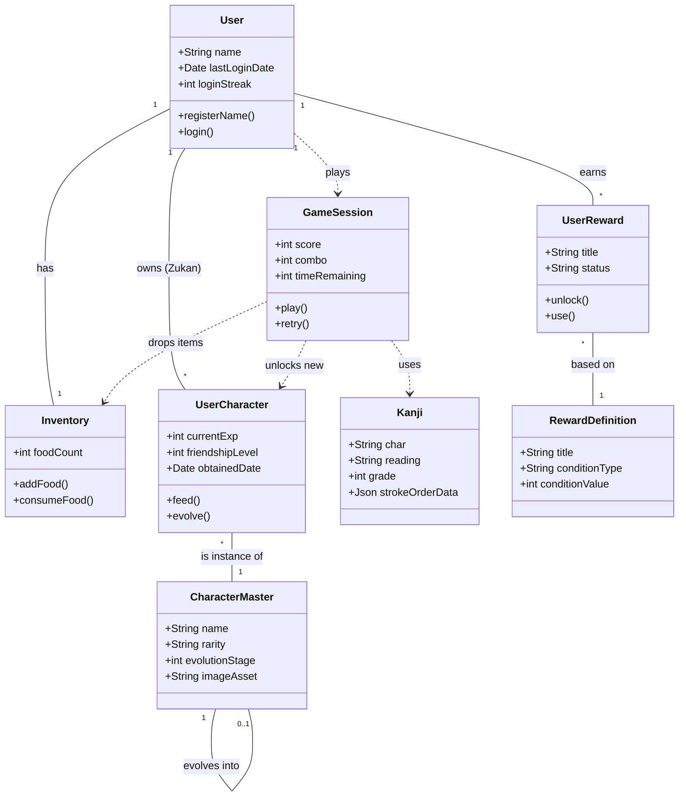

# オブジェクトモデリング (Domain Object Model)

各エピック（ユーザーストーリー）に基づき、システムに必要なドメインオブジェクトとその関係性を定義します。

## 1. 概念モデル図 (Mermaid Class Diagram)

---

## 2. オブジェクト詳細定義

### A. ユーザーコンテキスト (User Context)

#### **User (子供/プレイヤー)**
システムの中心となる主体。
*   **責任:** プレイヤーの識別、進行状況の保持。
*   **プロパティ:**
    *   `name`: プレイヤー名（ひらがな）。
    *   `lastLoginDate`: 最終ログイン日時（ボーナス判定用）。
    *   `loginStreak`: 連続ログイン日数。
*   **関連:** Inventory, UserCharacter, UserReward

#### **Inventory (もちもの)**
プレイヤーが所持しているアイテム（主にエサ）の管理。
*   **責任:** エサの増減管理。
*   **プロパティ:**
    *   `foodCount`: 所持しているエサの数。
    *   `specialItems`: （将来用）進化アイテムなど。

#### **UserCharacter (相棒/図鑑データ)**
ユーザーが獲得した個別のキャラクター状態。
*   **責任:** 育成状況（経験値・なつき度）の保持。
*   **プロパティ:**
    *   `currentExp`: 現在の経験値。
    *   `friendshipLevel`: なつき度（ハートの数）。
    *   `isNew`: 図鑑でまだ詳細を見ていないフラグ。
*   **振る舞い:**
    *   `feed()`: エサを消費して経験値/なつき度を上げる。
    *   `evolve()`: 進化条件を満たした時、参照するCharacterMasterIDを更新する。

---

### B. マスターデータ (Master Data)

#### **Kanji (漢字の精霊)**
学習対象となる漢字データ。
*   **責任:** 落ち物パズルの出題データ、書き順データの提供。
*   **プロパティ:**
    *   `char`: 漢字そのもの（例：「山」）。
    *   `reading`: 正解の読み（例：「やま」）。
    *   `wrongReadings`: ダミーの選択肢候補。
    *   `strokeOrderData`: 書き順アニメーション用のベクターデータ。

#### **CharacterMaster (キャラクター定義)**
キャラクターの基本設定。
*   **責任:** キャラクターの見た目や進化系統の定義。
*   **プロパティ:**
    *   `name`: キャラクター名。
    *   `rarity`: レアリティ（Normal, Rare, SuperRare）。
    *   `evolutionStage`: 進化段階（1, 2, 3）。
    *   `nextEvolutionId`: 進化後のキャラクターID（なければnull）。
    *   `requiredExpToEvolve`: 進化に必要な経験値。

---

### C. ゲームプレイコンテキスト (Gameplay Context)

#### **GameSession (クエスト/冒険)**
1回のゲームプレイ（落ち物パズル）の状態。
*   **責任:** スコア計算、クリア判定、ドロップアイテムの生成。
*   **プロパティ:**
    *   `clearedCount`: 正解数（目標10問）。
    *   `currentLife`: 残りライフ。
    *   `combo`: 現在のコンボ数。
*   **振る舞い:**
    *   `judge(input)`: ユーザーの入力（読み）を判定する。
    *   `dropLoot()`: クリア時にCharacterやItemを生成してUserに渡す。

---

### D. 保護者・報酬コンテキスト (Parent Context)

#### **ParentSettings (保護者設定)**
*   **責任:** 保護者機能へのアクセス制限、カスタムご褒美の定義。
*   **プロパティ:**
    *   `securityGate`: ロック解除ロジック（計算問題など）。
    *   `definitions`: 作成されたRewardDefinitionのリスト。

#### **RewardDefinition (ご褒美の約束)**
親が作成したご褒美のルール。
*   **プロパティ:**
    *   `title`: ご褒美の内容（例：「サイゼリヤに行く」）。
    *   `conditionType`: 達成条件の種類（キャラ数、クリア数など）。
    *   `conditionValue`: 目標値（例：20体）。

#### **UserReward (ご褒美チケット)**
条件達成後に子供に付与される権利。
*   **状態:**
    *   `Locked`: 条件未達成。
    *   `Unlocked`: 達成済み（アニメーション演出待ち）。
    *   `Available`: チケットとして所持中。
    *   `Used`: 親が承認して使用済み。
