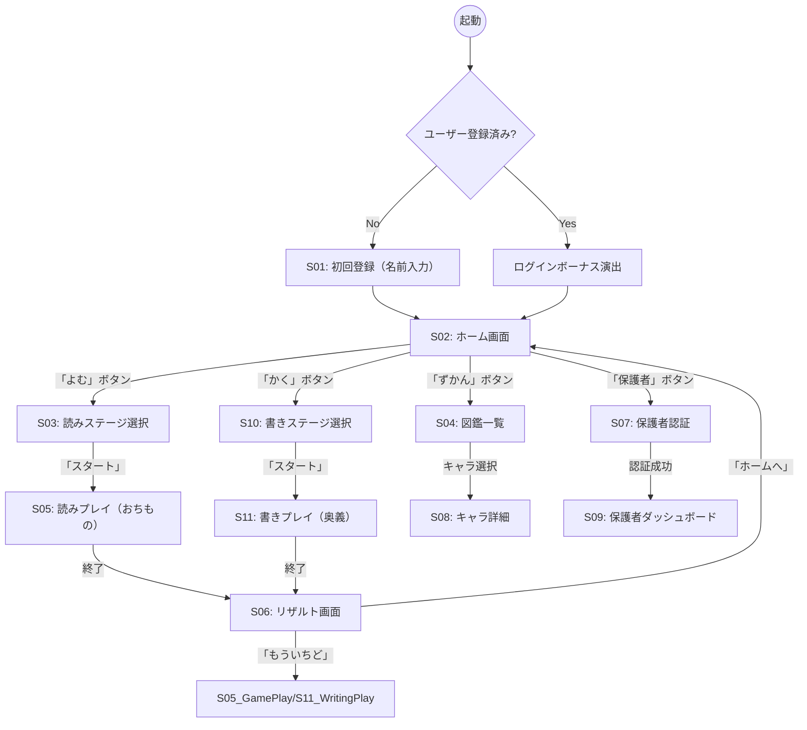

# 画面設計書 (Screen Design Document)

## 1. 概要
本ドキュメントでは、各Epicおよびユースケースを実現するための具体的な画面構成と遷移を定義します。
「読み（おちもの）」と「書き（奥義）」を二大コンテンツとして並列に扱います。

## 2. 画面遷移図 (Screen Flow)

---

## 3. 画面詳細定義

### S01: 初回登録画面 (Onboarding)
*   **関連Epic:** `Game Start`
*   **目的:** ユーザー（子供）の名前を登録し、自分だけの物語であることを認識させる。

| UI要素 | 説明 | アクション |
| :--- | :--- | :--- |
| **メッセージ** | 「あなたの なまえを おしえてね」 | |
| **名前入力欄** | 大きなテキストフィールド。ひらがな入力推奨。 | |
| **決定ボタン** | 「これで はじめる！」 | バリデーション後、データを保存しホームへ遷移。 |
| **背景** | 冒険の始まりを感じさせる明るい背景。 | |

### S02: ホーム画面 (Home)
*   **目的:** ゲームの拠点。2つのモードへの分岐点。

| UI要素 | 説明 | アクション |
| :--- | :--- | :--- |
| **ヘッダー** | ユーザー名、ランク、所持エサ数。 | |
| **パートナーキャラ** | 画面中央。 | タップで挨拶/エサやり。 |
| **「よむ」ボタン** | 大きなボタン。「おちものパズル」へ。 | S03へ遷移。 |
| **「かく」ボタン** | 大きなボタン。「おうぎ（書き取り）」へ。 | S10へ遷移。 |
| **サブメニュー** | 「ずかん」「おやつ」 | 各画面へ遷移。 |
| **デイリーミッション** | 今日の目標。 | 詳細確認。 |

### S03: 読みステージ選択 (Reading Stage Select)
*   **目的:** 読みゲームの設定。

| UI要素 | 説明 | アクション |
| :--- | :--- | :--- |
| **学年選択** | 1〜6年生。 | |
| **スピード設定** | ゆっくり/ふつう/はやい。 | |
| **スタート** | ゲーム開始。 | S05へ遷移。 |

### S04: 図鑑一覧画面 (Collection List)
(変更なし)

### S05: 読みプレイ画面 (Game Play - Reading)
*   **目的:** 落ち物パズルによる読み学習。

| UI要素 | 説明 | アクション |
| :--- | :--- | :--- |
| **プレイエリア** | 漢字落下エリア。 | |
| **回答ボタン** | 3択（ひらがな）。 | 正誤判定。 |
| **HUD** | 制限時間、ライフ、スコア。 | |

### S06: リザルト画面 (Result)
*   **目的:** 結果発表と報酬付与（読み・書き共通）。

| UI要素 | 説明 | アクション |
| :--- | :--- | :--- |
| **スコア/評価** | 「読み」なら点数、「書き」ならクリア数や「はなまる」。 | |
| **獲得アイテム** | エサ、キャラのドロップ演出。 | |
| **次へ** | ホームへ戻る、または再挑戦。 | |

### S07: 保護者認証画面 (Parent Auth)
(変更なし)

### S08: キャラクター詳細画面 (Character Detail)
*   **修正:** ここからの「書き取り」導線は補助的なものとする（メインはS02から）。

| UI要素 | 説明 | アクション |
| :--- | :--- | :--- |
| **基本情報** | 画像、名前、レベル等。 | |
| **「進化」** | 進化ボタン。 | |
| **「練習する」** | この漢字を書き取りモードで練習するショートカット。 | S11へ遷移（特定の漢字を指定して開始）。 |

### S09: 保護者ダッシュボード (Parent Dashboard)
(変更なし)

### S10: 書きステージ選択 (Writing Stage Select)
*   **新規**
*   **目的:** 書き取り練習をする漢字セットを選ぶ。

| UI要素 | 説明 | アクション |
| :--- | :--- | :--- |
| **学年選択** | 1〜6年生。 | |
| **セット選択** | 「ランダム5もん」「にがてな漢字」「あいうえお順」など。 | |
| **モード選択** | 「なぞり書き（アプリ）」or「ノート（リアル）」 | モードフラグを設定。 |
| **スタート** | 練習開始。 | S11へ遷移。 |

### S11: 書きプレイ画面 (Game Play - Writing)
*   **新規**
*   **目的:** 書き順確認となぞり書き/模写の実践。

| UI要素 | 説明 | アクション |
| :--- | :--- | :--- |
| **漢字表示エリア** | 大きく漢字を表示。アニメーション再生可。 | |
| **なぞり判定** | (アプリモード時) 画面上のCanvasになぞって書く。 | 書き順・形状判定。 |
| **自己申告ボタン** | (ノートモード時) 「ノートにかいた！」ボタン。 | 次の問題へ。 |
| **進行バー** | 現在何問目か（例: 3/5）。 | |
| **やめる** | 中断してホームへ。 | |
